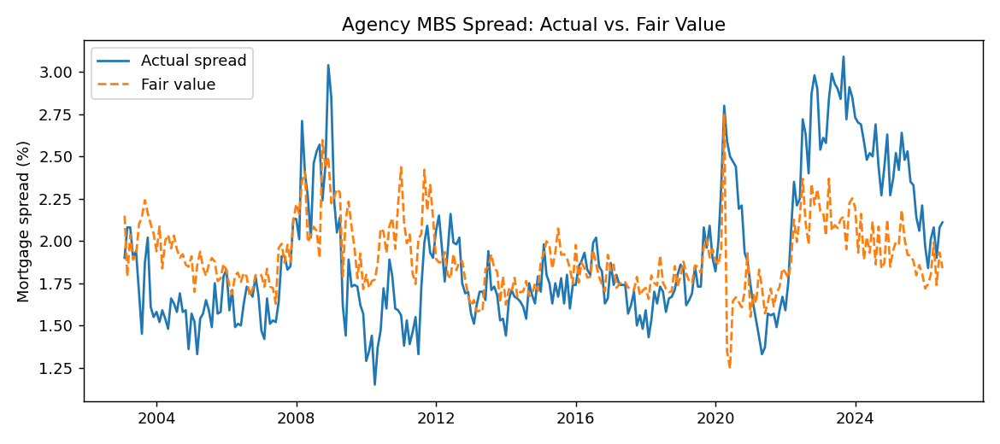
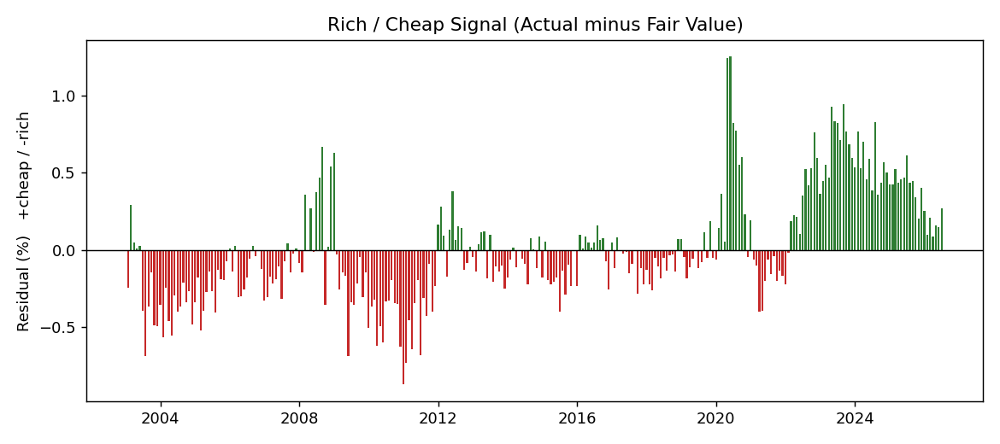
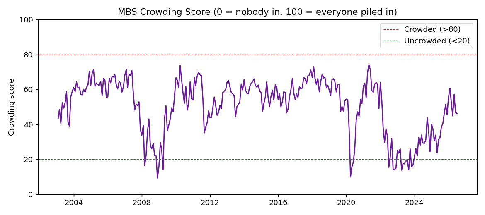

# Agency MBS Fair Value Monitor

A transparent model that estimates a **fair-value mortgage spread** from public supply-and-demand technicals, flags when agency MBS look **rich, cheap, or crowded**, and analyzes how the market behaved across major rate regimes.

The premise: agency MBS carry effectively no credit risk (they're government-backed), so their spreads are driven by **technicals** — supply, demand, and interest-rate volatility — rather than fundamentals. This project tests how much of the mortgage spread can be explained by a few such drivers, adds a positioning overlay, and looks at behavior in stress episodes.

## Method

**Dependent variable — mortgage spread (proxy):**
`MORTGAGE30US` (30-year fixed mortgage rate) − `DGS10` (10-year Treasury yield). A standard free proxy for the agency MBS spread. (A true option-adjusted spread, OAS, requires paid data.)

**Drivers (supply and demand):**
- **Rate volatility** — 21-day rolling standard deviation of daily changes in the 10-year Treasury yield. MBS are negatively convex, so investors demand more spread when rate volatility rises. (A free proxy for the MOVE index.)
- **Fed absorption** — month-over-month change in the Fed's MBS holdings (`WSHOMCB`). Under QE the Fed soaks up supply (spreads tighten); under QT it sheds MBS (spreads widen).
- **Commercial bank demand** — month-over-month change in Treasury & agency securities held by all commercial banks (`TASACBW027SBOG`, H.8). Banks are a major holder of agency MBS; tested as a demand channel.

**Model:** ordinary least squares,
`spread ~ rate_volatility + fed_mbs_change + bank_demand_change`.
The fitted value is the **fair-value spread**; the residual (actual − fair value) is a **rich/cheap signal** (positive = cheap, negative = rich).

**Crowding overlay (0–100):** a transparent positioning proxy. The market looks "crowded" into MBS when the spread is rich versus fair value (everyone has bought, so it trades tight) and rate volatility is low (calm markets let positioning build). Both are standardized and mapped to a 0–100 score, where higher means more crowded.

**Regime analysis:** the model is examined across three stress episodes — the 2013 Taper Tantrum, the 2020 COVID shock, and the 2022 QT / rate shock — to see how spreads, fair value, and the crowding score behaved.

## Data (all free, FRED, no API key)

| Series | FRED code |
|--------|-----------|
| 30-year fixed mortgage rate | `MORTGAGE30US` |
| 10-year Treasury yield | `DGS10` |
| Fed MBS holdings (SOMA) | `WSHOMCB` |
| Bank Treasury & agency securities | `TASACBW027SBOG` |

## Results







With three technical drivers, the model explains about **25% of the variation in the agency MBS spread (R² = 0.25)**. **Rate volatility is the dominant, highly significant driver** (coefficient ≈ 9.6, p < 0.001): higher rate volatility widens spreads, consistent with the negative convexity of MBS. The **change in Fed MBS holdings is also significant and negative** (p < 0.001) — Fed purchases tighten spreads while quantitative tightening widens them. **Commercial bank demand**, proxied by total Treasury and agency holdings, **was not statistically significant** (p = 0.65), suggesting the broad proxy does not cleanly capture MBS-specific demand. Across regimes, the **2022 QT episode saw the largest spread widening (+0.78pp)**, consistent with the Fed withdrawing support, while 2013 and 2020 were more muted.

## How to run

**Python**
```bash
pip install -r requirements.txt
python src/fetch_and_model.py
```

Pulls the live FRED data, runs the regression, writes the charts, `data/merged.csv`, and `data/regime_summary.csv`, and prints the regime table.

## Limitations

- The dependent variable is a **proxy** spread (mortgage rate minus Treasury), not a true option-adjusted spread (OAS), which requires paid data.
- The rate-volatility input is a **proxy** for the MOVE index.
- Bank demand is proxied by total Treasury & agency holdings, not MBS-only, and was not significant in this specification.
- The sample is **monthly**, so results are explanatory, not a high-frequency trading signal; residuals are autocorrelated.
- This is a deliberately **transparent** model. Desks add net issuance and paydowns, dealer positioning, and prepayment dynamics.

## Possible extensions

- Add net agency MBS issuance and paydowns for a fuller net-supply measure.
- Replace the broad bank proxy with an MBS-specific holdings series.
- Incorporate primary-dealer positioning (NY Fed) into the crowding overlay.
- Swap the proxy spread for a true MBS OAS series if terminal data becomes available.

---
*Built as an independent learning project. Data: Federal Reserve Economic Data (FRED), St. Louis Fed.*
